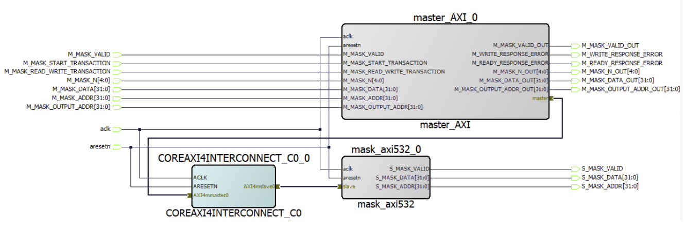

# [AXI4 Lite Integration Tutorial]
- **GOAL:** Access an OLED PMOD using the SPI protocol with a hardware design running on the FPGA fabric.
- HDL files are defined [here](./hdl)

### Goal
- Design a tutorial that incorporate AXI4Lite interface to help teach student of the protocol
- Implement and AXI wrapper arround the the custom IP module such that the custom IP can be integrated to the digital system

### Important Notes
This project did not go through the whole Libero design flow. The AXILite system desing has addition ports instantiated in the top level for debugging the simulation. Because of these addtional port instantantiation, we have exceeded the max number of IO offered by the board, hence Synthesis and Implementation failed. 

Hence, this tutorial was only simulated on ModelSim Pro.

### Block Diagram

### Project Description
To begin with, the hardware design in the AXI4 Lite tutorial is based on Assignment 1 from ECE 532, a course offered at University of Toronto. Assignment 1 for ECE 532 requires students to build AXI wrapper arround mask532 module that contains both master and slave AXI channels. However, in this tutorial, we will be only focusing on designing a wrapper arround a mask532 module that contains only the slave AXI channels. Hence, this design will utalize some signals that are artifact of the assignment.

As seen in the block diagram, a core of the tutorial focuses on creating an AXI wrapper around mask532 module. The mask532 module is a simple hardware that masks the n least significant bits of a 32 bit data. For instance, consider input data for the mask532 module being 0x01234567 and number of bits to mask, n, to be 12. Hence, the output of the module will produce a value of 0x0124000. 

In the grand scheme of the design, n and the input data will be value will be sent to the mask532 module via the AXI channel, hence, these registers will be assigned an address. In addition, there is other memeory mapped registers in the design, perticulary output addr and init valid. As mentioned, these are artifact but was used to increase the complexity of the AXI wrapper control logic. Plus, these registers was used was control signals to verify if the input data going to the AXI channel through the master is the same as the data comming out of the channel in the slave module.

The following are the AXI memory mapped address the registers:

| Address        | Reg/Signal Name |
|----------------|-----------------|
| 0x00000000     | n_value         |
| 0x00000004     | data_value      |
| 0x00000008     | output_addr     |
| 0x0000000C     | init_write      |

Unfortunately, Libero SoC does not have an simmulation IP to simulate AXI transactions, similar to Vivado AXI VIP. So, a master module was create to facilitate handshaking with the mask532 AXI slave wrapper. In fact, the testbench will use the master module as a medium to send stimuli to the AXI slave module. Now a question arises, why create a master module if we can implemented the logic in the test bench? Well, we can do that, but this tutorial also shows students to create and connect AXI channel between module. Hence, this knowledge would be lost if we implemented the handshaking via the testbench.

Below is the SmartDesign implementation of the design

One important thing to mention is that Libero SmartDesign does not allow connection between two bus channels of custom IPs. So in our implementation, we can not directly connect the master module with mask532 slave interface though the AXI bus. To bypass it, we would need to use the AXI interconnect as in the design. Basically, channels ports from an custom IP can currently only connect to microchip IPs. 

 ### IO Layout
 N/A