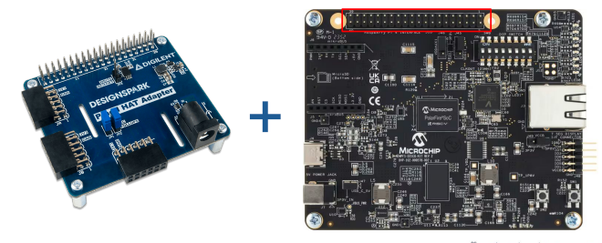
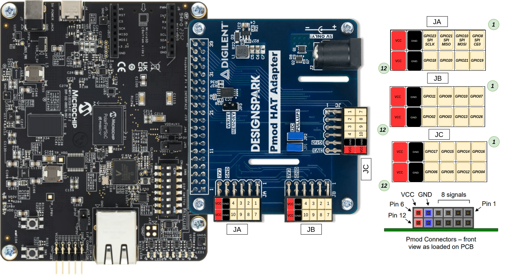
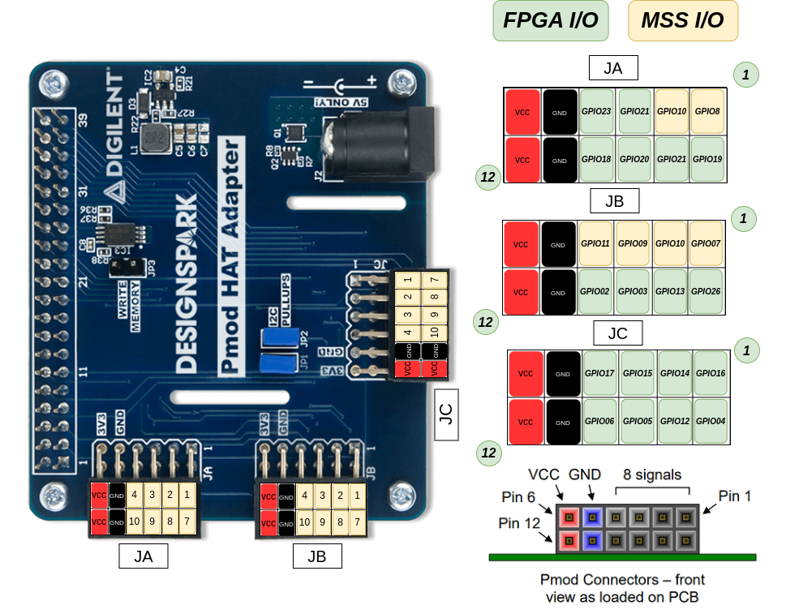

# Project Repository

This repository contains two projects based on [OLED PMOD](./oled_try2) and [UART_PMOD](./UART_TOP). Below are brief descriptions of each project:

## Projects

### [UART PMOD](./UART_TOP)
- **GOAL:** Receive ASCII characters from a computer via a USB-UART PMOD and loop them back.

### [OLED PMOD](./oled_try2)
- **GOAL:** Access an OLED PMOD using the SPI protocol with a hardware design running on the FPGA fabric.

## Sensor Connection:

- This repository uses the [Pmod HAT Adapter](https://digilent.com/shop/pmod-hat-adapter-pmod-expansion-for-raspberry-pi/) to extend a Raspberry Pi into 3 PMODs. The discovery kit does not have PMOD outputs on the board, which is why we had to use this card. The daughter card is compatible with the Digilent PMOD layout.

### Hardware setup: 

### Sensor pinout (GPIO):

### Sensor pinout (I/O type):

