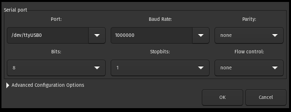
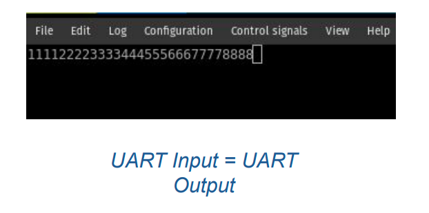

# [UART PMOD](./UART_TOP)
- **GOAL:** Receive ASCII characters from a computer via a USB-UART PMOD and loop them back.
- HDL files are defined [here](./hdl)
- The RTL code from this [example](https://github.com/nandland/nandland/tree/master/uart) is being used, and we have ported it for this discovery board.

### RTL Top:

### Pin Configuration Table

| Port Name  | Direction | Pin  | Description |
|------------|-----------|------|-------------|
| i_Clk      | input     | R18  |    25 MHz clock (See the timing constraint)     |
| i_Reset    | input     | T19  |    Switch 1 on board         |
| i_UART_RX  | input     | B14  |    PMOD - JA Slot - RX         |
| o_UART_TX  | output    | E13  |    PMOD - JA Slot - TX         |

### Block diagram:

### Hardware setup:
- Use the bottom pins of PMOD slot JA (7-12) to connect USB-UART PMOD sensor. This sensor can be bought from [here](https://digilent.com/shop/pmod-usbuart-usb-to-uart-interface/)

### Programming:

- Program the FPGA board with the RTL. [Run program action --> Run]
- Connect a host CPU to the USB-UART pmod using Micro-USB interface.
- Set the UART settings as follows:
    - Baud rate: 1000000
    - Parity: none
    - Bits: 8
    - Stopbits: 1
    - Flow control: No

### Output:

- The keys send via UART terminal will be echoed back.

