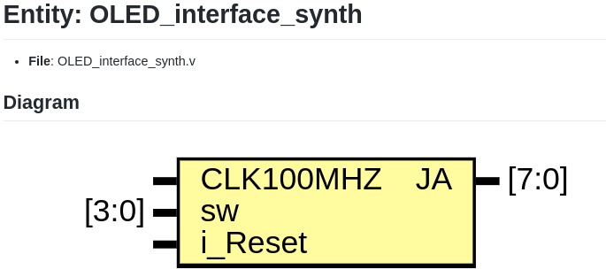

# [OLED PMOD](./oled_try2)
- **GOAL:** Access an OLED PMOD using the SPI protocol with a hardware design running on the FPGA fabric.
- HDL files are defined [here](./hdl)
- The RTL code from this [example](https://github.com/JakeHafele101/FPGA_SSD1331_OLED_Interface) is being used, and we have ported it for this discovery board.

### RTL Top:

### Pin Configuration Table

| Port Name  | Direction | Pin  | Description |
|------------|-----------|------|-------------|
| CLK100MHZ  | input     | R18  | 100 MHz Clock            |
| sw[0]      | input     | U17  | determines MODE: 10 {sw[1:0]} --> Display characters |
| sw[1]      | input     | Y16  | |
| sw[2]      | input     | R17  | btnU |
| sw[3]      | input     | AA15 | btnD |
| i_Reset    | input     | T19  | SW1 on board            |
| JA[0]      | output    | B15  | s_CS (GPIO 16) |
| JA[1]      | output    | A20  | s_MOSI (GPIO 14) |
| JA[2]      | output    | B21  | 1'b0 (GPIO 15) |
| JA[3]      | output    | G18  | s_SCK (GPIO 17) |
| JA[4]      | output    | E12  | s_DC (GPIO 04) |
| JA[5]      | output    | B20  | s_RES (GPIO 12) |
| JA[6]      | output    | D17  | s_VCCEN (GPIO 05) |
| JA[7]      | output    | D18  | s_PMODEN (GPIO 06) |

### Block diagram:

### Hardware Setup:
- Use the PMOD slot JC to connect OLED PMOD sensor. This sensor can be bought from [here](https://digilent.com/shop/pmod-oledrgb-96-x-64-rgb-oled-display-with-16-bit-color-resolution/)

### Programming:

- Program the FPGA board with the RTL. [Run program action --> Run]
- Set the dip switches in the following pattern:
    - SW[0] : HIGH
    - SW[1] : LOW
    - SW[2] : LOW
    - SW[3] : LOW
- Click push button 1 (SWITCH1) to reset the OLED. Once restarted, the RTL logic will display ASCII characters on the OLED.

### Output:

